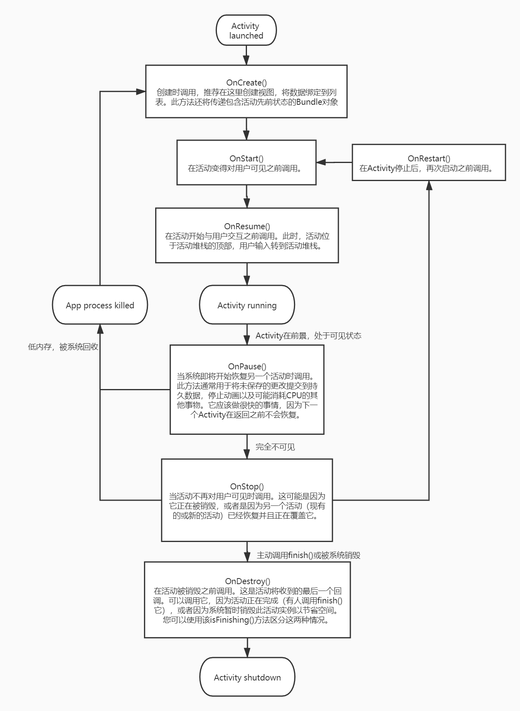

> 本文将详细讲解 Activity 的生命周期、启动流程，并对源码进行一些分析。
<!-- more -->

***

## Activity 生命周期

### Activity 状态和从内存中弹出 
系统会在需要释放内存时终止进程；系统终止给定进程的可能性取决于当时进程的状态。反之，进程状态则取决于在进程中运行的 Activity 的状态。进程状态、Activity 状态，以及系统终止进程的可能性的相互关系如表所示。

| 系统终止进程的可能性 | 进程状态 | Activity 状态 |
| ------------------ | -------- | -----: |
| 小 | 前台（拥有或即将获得焦点） | OnCreate( )  OnStart( )  OnResume( )|
| 中 | 后台（失去焦点） | OnPasue( )|
| 大 | 后台（不可见） | OnStop( )|
|    | 空 | OnDestroy( ) |

系统永远不会直接终止 Activity 以释放内存，而是会终止 Activity 所在的进程。系统不仅会销毁 Activity，还会销毁在该进程中运行的所有其他内容。

### Activity基本上存在于三种状态，其他状态都会很快结束

1.  恢复 onResume()
Activity位于屏幕的前景并具有用户焦点可以交互。

2. 已暂停 onPause()
Activity在后台并失去焦点，但用户仍然可以看见该 Activity。有两种情况：
* 另一个Activity在这个Activity的顶部可见，该Activity部分透明或不覆盖整个屏幕；
* 或者处于多窗口模式，该 Activity 没有焦点。

`例1：玩游戏时弹出活动弹窗，这个弹窗的Activity处于OnResume()状态。如果这个时候能看到下方的游戏界面，此时游戏Activity处于OnPasue()状态；如果是个全屏弹窗，看不到游戏界面，此时游戏Activity处于OnStop()状态。`
`例2：打开分屏模式，一边是微信，一边是游戏，两边的Activity均可见。此时用户点击了哪边，哪边就得到焦点，处于OnResume()状态，而另外一边则处于OnPasue()状态。`

暂停的 Activity 完全处于活动状态（Activity 对象保留在内存中，它保留所有状态和成员信息，并保持附加到窗口管理器），但可以在极低内存情况下被系统杀死。

3. 停止 onStop()
该Activity完全被另一个Activity遮挡，不可见。停止的Activity也仍然存在（Activity 对象保留在内存中，它维护所有状态和成员信息，但不 附加到窗口管理器）。但是，它不再对用户可见，并且当其他地方需要内存时，它可能被系统杀死。
如果Activity暂停或停止，系统可以通过要求它完成（调用其finish()方法）或简单地终止其进程来从内存中删除它。当活动再次打开时（在完成或杀死之后），必须全部创建它。

