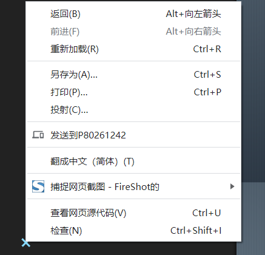
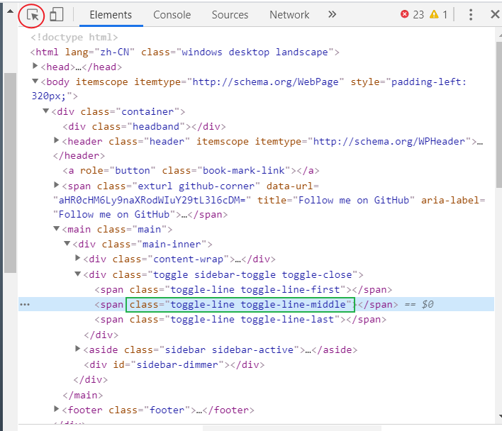
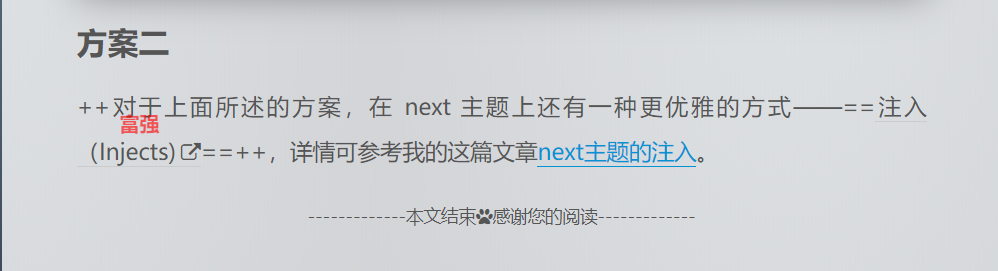

> 打造与众不同的个性化博客，还没有自己博客的[_请点击这里。_](https://zhuanlan.zhihu.com/p/44213627)
**知识储备：** 熟悉 html、css 、js

1. 方案一：直接修改源代码的布局、样式
2. 方案二：使用[next主题的注入](next主题的注入)
* * *

<!-- more -->

## 方案一

下面以[_Next7.7 主题_](https://theme-next.org/)为例：
### 主题结构
首先来看一下 next 的文件结构：
```language
├─.github
│  └─ISSUE_TEMPLATE
├─docs //说明文档
│  ├─ru
│  └─zh-CN
├─languages //多语言
├─layout //布局
│  ├─_macro //小部件
│  ├─_partials //组成html的每一部分
│  │  ├─head
│  │  ├─header
│  │  ├─page
│  │  ├─post
│  │  ├─search
│  │  └─sidebar
│  ├─_scripts //集成的第三方插件布局
│  │  ├─pages
│  │  └─schemes
│  └─_third-party //第三方插件
│      ├─analytics
│      ├─chat
│      ├─comments
│      ├─math
│      ├─search
│      ├─statistics
│      └─tags
├─scripts //脚本
│  ├─events
│  │  └─lib
│  ├─filters //注入
│  │  └─comment
│  ├─helpers
│  └─tags
└─source //源码
    ├─css
    │  ├─_common
    │  │  ├─components
    │  │  │  ├─pages
    │  │  │  ├─post
    │  │  │  └─third-party
    │  │  ├─outline
    │  │  │  ├─footer
    │  │  │  ├─header
    │  │  │  └─sidebar
    │  │  └─scaffolding
    │  │      ├─highlight
    │  │      └─tags
    │  ├─_custom
    │  ├─_schemes
    │  │  ├─Gemini
    │  │  ├─Mist
    │  │  ├─Muse
    │  │  └─Pisces
    │  └─_variables
    ├─images
    │  └─abstract
    ├─js
    │  └─schemes
    └─lib
        ├─font-awesome
        │  ├─css
        │  └─fonts
        └─velocity

```
#### 首页布局

我们只需要关注 layout、source 这两个文件夹，先看 layout 下的 index.swig
```html
 <!-- _layout.swig首页的基础布局 -->

 <!-- sidebar.swig滑动块的布局 -->

{{ title }} - {{ subtitle }}

man



<div  class="posts-expand">



{{ partial('_macro/post.swig', {post: post, is_index: true}) }}  <!-- post.swig文章布局 -->



</div>

 <!-- pagination.swig上一篇、下一篇文章的布局 -->





{{ sidebar_template.render(false) }}


```
### 查找相应布局或 CSS

想要增加或删除哪一部分的布局，可直接打开对应的 swig 文件 进行修改即可。
如果只是想美化某一部分的样式，先在浏览器上找到该布局对应的 css 类，若使用谷歌浏览器可直接右键检查，

或者按 F12 进入开发者模式选择元素

然后打开 _source/css/\_variables/base.styl_  文件，或者在 source/css 目录下新增/_custom/custom.styl 文件，对找到的属性进行 x。
### 示例
例如：在每篇文章结束的时候加上一句话。
#### 引入布局
打开 _layout/\_macro/post.swig_，发现文章结束时有个 END POST BODY 的标记，在该标记前加上
```html
<div>
  
     <!-- 设置开关 -->
      
    
  
</div>
```
#### 编写布局
新建上面代码引入的布局文件 即_layout/\_macro/passage-end-tag.swig_，加入下面代码
```html
<div>
  <div  style="text-align:center;color: #555;font-size:14px;">
    -------------本文结束<i class="fa fa-paw"></i>感谢您的阅读-------------
  </div>
</div>
```
#### 打开开关
在主题配置文件即 _next/\_config.yml_ 里添加
```yaml
passage_end_tag:
  enable: true
```
#### 效果展示


***

## 方案二
++对于上面所述的方案，在 next 主题上还有一种更优雅的方式——==[注入（Injects)](https://theme-next.org/docs/advanced-settings)==++，详情可参考我的这篇文章[next主题的注入](next主题的注入)。
